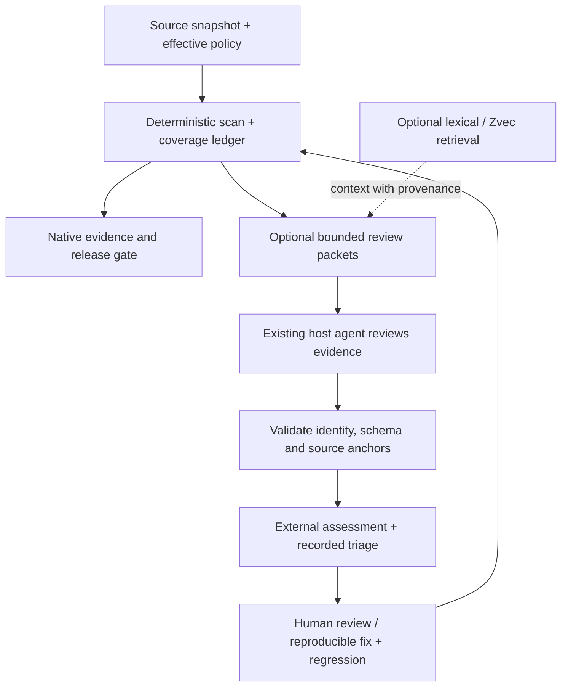

# ShipProof: Evidence Quality and Agent Review Plan

วันที่: 2026-09-15 · สถานะ: proposed implementation plan · ยังไม่มี milestone ใดผ่าน acceptance จากเอกสารนี้

## 1. เป้าหมายผลิตภัณฑ์

ทำให้ ShipProof เป็นเครื่องมือที่ผู้ใช้ไว้ใจให้ช่วยตัดสินใจเรื่อง release: ตรวจพบบัคที่มีหลักฐาน, อธิบายสิ่งที่ตรวจไม่ถึง, และช่วยแก้ได้ตรงจุดในเวลาที่เหมาะสม

คำว่า “best” ในแผนนี้วัดจากผลบนชุดทดสอบที่เปิดเผยและการใช้งานจริง ไม่ใช้จำนวนกฎ ดาว GitHub หรือคะแนนจากผู้พัฒนาเครื่องมืออื่นเป็นตัวแทนคุณภาพ

ลำดับหลัก: **evidence integrity → detector quality → useful agent review → measured retrieval → release reliability**

ใช้แผนนี้เป็นลำดับงานสำหรับการปรับใช้ [Open Code Review / Zvec](alibaba-adoption-review.md) และปิดช่องว่างคุณภาพที่พบล่าสุด โดยใช้ [roadmap เดิม](../docs/next-development-plan.md), [promotion gates](../docs/rule-expansion-1000.md) และ [community validation](../docs/community-validation.md) เป็นข้อกำหนดร่วม ไม่เริ่มระบบที่มีอยู่แล้วซ้ำ

## 2. Baseline ที่ตรวจจริง

| รายการ | หลักฐาน ณ วันที่วางแผน | ผลต่อแผน |
| --- | --- | --- |
| Working tree | HEAD เริ่มต้น `c692cc4548907f3f57aa7e2489edd1278e37f7da`; manifest ปัจจุบันเป็น 0.11.1 และมีงาน release แก้ค้างอยู่ | ตรึง commit และ dirty-diff digest อีกครั้งก่อนเริ่ม implementation; ไม่รวมงานอื่นโดยปริยาย |
| Executable rules | `build_report()` ใน `scripts/rule_assurance_report.py`: 635 complete, 0 partial/uncontracted | ขั้นต่ำของ contract ครบ; ยังไม่ใช่หลักฐาน precision บน production |
| Realistic negatives | 58 กฎมี realistic negative; 577 มีเฉพาะ near-miss negatives; high/critical ขาด realistic negatives 443 กฎ | ปรับคุณภาพ fixture และ semantics เป็นงานหลักก่อนเพิ่ม catalog |
| External evidence | synthetic probe ของ `load_envelope` ยอมรับวันที่ปี 2020 และ digest ที่ไม่ได้เทียบกับ checkout | ต้องแยก validation รูปแบบ, identity, อายุ และความน่าเชื่อถือของผู้สร้างผล |
| สิ่งที่มีแล้ว | L0/L1/L2, proof threshold, completeness, suppression, fix-prompt/context, cross-file JS/TS/Python, native evidence adapters, label/evaluator scripts | ต่อเติม contract และเส้นทางเดิม |
| Upstream | อ่าน source และ tests ที่ commit ตรึงใน adoption review | ไม่มีผล runtime/benchmark ของ upstream ที่นำมาอ้างว่าดีกว่าได้ |

ตัวเลข baseline มาจาก working tree ที่กำลังเปลี่ยน ไม่ใช่ผลของ release commit ที่ตรึงแล้ว เก็บ snapshot ใหม่ในงาน Q00 และรายงานผลต่างทุกครั้ง

## 3. ข้อกำหนดที่ทุก milestone ต้องรักษา

1. Default scan/check ทำงาน offline, read-only, dependency-free; optional review/retrieval ต้องไม่ถูกเรียกเองจาก default path
2. รักษา exit `0/1/2` และ proof threshold ปัจจุบัน; semantic/model scores ไม่กลายเป็น native proof หรือสิทธิ์ suppress
3. ทุกผลต้องระบุ source scope, effective policy และสถานะความครบถ้วน; zero findings ไม่เพียงพอที่จะอ้าง complete pass
4. แยก `reported severity`, `proof`, `gate eligibility`, `triage status` และ `source role` ออกจากกัน
5. บัคใน implementation ต้องมี trigger/data-flow; ตัวอย่างอันตรายใน rule text เป็นข้อมูลได้ แต่โค้ดอันตรายที่อยู่ในโฟลเดอร์ชื่อ tests/research ก็อาจถูกใช้งานจริง
6. กฎที่ noisy ต้องแก้ semantics หรือเปลี่ยน eligibility โดยมีผลกระทบที่ review ได้ ห้ามเปลี่ยนชื่อโฟลเดอร์/exclude/เพิ่ม budget เพื่อทำให้ผลดูผ่าน
7. เก็บผลต้นฉบับและประวัติ triage; label จากโมเดลแยกจาก label ที่ผู้ตรวจยืนยัน
8. Default adapters ใช้ตัวตัดสินเดียวกัน; schema/fingerprint/CLI breaking changes ต้องมี migration และ version decision ที่ชัดเจน

## 4. โครงสร้างที่เสนอ



Raw findings เป็นข้อมูลอ้างอิงหลัก การจัดกลุ่มใน UI หรือการประเมินของ agent ต้องย้อนกลับไปหาทุกรายการต้นฉบับได้ ส่วน index เป็นข้อมูลสร้างใหม่ได้และไม่เป็นแหล่งตัดสิน release

## 5. Milestone A — Evidence integrity (ต้องเสร็จก่อนเชื่อม reviewer)

### Q00 — ตรึง baseline และแยก release work

- [ ] บันทึก commit, dirty-diff digest, runtime/OS, effective options, schema/scanner identity และผลตรวจปัจจุบัน
- [ ] รัน required local checks หลังงานปัจจุบันอยู่ในสภาพตรวจได้; เก็บ failure เดิมและใหม่แยกกัน
- [ ] ตรวจสมมติฐานของ 0.11.1 เรื่อง host symlink และ ignored/research coverage ด้วย paired cases: catalog data ปลอดภัย, executable payload ใน tree เดียวกัน, nested scan root, selected/changed paths
- [ ] เพิ่ม adversarial cases สำหรับ runtime shadowing, output symlink/reparse, parser failures, truncated Python, finding/line limits และ terminal controls ตามช่องทางที่ได้รับผล

Acceptance: ครบทั้ง safe และ unsafe variants; intentional scope omission ปรากฏใน ledger; ไม่มี unresolved regression ที่ทำให้หลักฐานผิดแต่ gate ผ่าน จึงเริ่ม Q01 ได้ งานนี้เป็นการ recheck ไม่ใช่การรับรองว่า patch ปัจจุบันผิด

### Q01 — นิยาม evidence identity และตรวจจริง

ไฟล์หลัก: `scripts/import_external_evidence.py`, `schemas/external-evidence.schema.json`, scanner report builders และ tests ที่เกี่ยวข้อง

- [ ] นิยาม canonical encoding แบบ versioned: relative path, file bytes/digest, selected set, relevant dependency context, scanner/rules identity และ effective policy; แยก secret credential ออกจาก config identity
- [ ] Git mode ตรึง commit ที่ resolve แล้ว; workspace mode ผูกกับ bytes ที่อ่านจริงและตรวจการเปลี่ยนระหว่างอ่าน หากตรวจไม่เสถียรให้ evidence unavailable
- [ ] Target identity ไม่ขึ้นกับ absolute install path; filesystem access ยังใช้ canonical-root containment และ Windows case/alias checks
- [ ] ให้ evidence importer เทียบ target/config กับ expected values ที่ฝั่งผู้ใช้หรือ trusted CI คำนวณเอง ไม่รับ expected digest จาก envelope เดียวกัน
- [ ] แยก `identity matches`, `authorship verified`, `review complete`, `assessment verified`; digest ตรงกันไม่ได้พิสูจน์ว่า reviewer พูดจริง
- [ ] Timestamp ใช้ตรวจอายุตาม policy และ clock-skew allowance; อย่าปฏิเสธ evidence เพราะเก่าอย่างเดียวเมื่อ policy ไม่กำหนด expiry และ identity ยังตรง
- [ ] แบบเก่าเปิดอ่านเป็น unverified evidence ได้ถ้าต้องรักษา compatibility แต่ใช้ผ่าน gate/resume ไม่ได้; validation failure คืน exit 2
- [ ] Validate schema จริง: unknown/duplicate fields, null/coerced values, paths, ranges, future timestamps, byte/count/depth limits; ป้องกัน input replacement ระหว่าง stat/read

Acceptance: same-size/same-mtime edits, deleted context, moved refs, changed policy/rules และ wrong-root evidence ถูกตรวจพบ; valid unchanged snapshot มี identity คงที่; malformed evidence ไม่ crash และไม่กลายเป็น pass

### Q02 — ตรวจตำแหน่งและ scope ของ external comments

- [ ] ทุก comment ระบุ revision, path, old/new side, range และ bounded excerpt หรือ source anchor
- [ ] ตรวจเลขบรรทัดที่กรอกมาแล้วด้วย ไม่เชื่อเพราะเป็นตัวเลขบวก
- [ ] Matching ต้องมีตำแหน่งเดียวใน scope ที่อนุญาต; หากซ้ำในไฟล์เดียวหรือหลายไฟล์ให้ `unresolved`
- [ ] Rename/deletion ต้องรักษา side/revision; ไม่ย้าย comment ไปไฟล์นอก scope โดยเงียบ
- [ ] แยก “ตำแหน่งถูก” ออกจาก “ข้อกล่าวหาถูก”; ไม่มี source match ยังเก็บเป็นคำถามให้ review ได้

Acceptance: repeated code, Unicode, CRLF/LF, old-side deletion, renamed paths, stale context และ fabricated ranges มี regression tests; invalid anchor ไม่ถูกเผยแพร่เป็น inline finding อัตโนมัติ

## 6. Milestone B — ลด false positives อย่างพิสูจน์ได้

### Q03 — เปลี่ยน fixture completeness เป็น realistic assurance

- [ ] ทำ inventory จากโค้ดทุกครั้ง: rule ID, severity/proof, ecosystem, actual entry points, realistic-positive/negative/adversarial counts, observed TP/FP/FN และ unknowns
- [ ] ตรวจคุณภาพ realistic-negative ด้วย semantic review; การเพิ่ม flag หรือเปลี่ยนชื่อตัวอย่างไม่ถือว่าปิดหนี้
- [ ] เลือก batch แรกไม่เกิน 20 กฎ จาก gate impact, reproduced noise และ production prevalence; ครอบคลุม false-positive กลุ่มที่มีหลักฐานก่อน
- [ ] แต่ละกฎต้องมี minimal vulnerable case, realistic safe counterpart และ transformation cases เช่น alias, formatting, comments/strings, guards, callbacks, import identity และ multi-file scope ตาม semantics
- [ ] เพิ่ม regression คู่สำหรับ “กฎ/fixture ที่เก็บโค้ดเป็น string” และ “โค้ดเดียวกันที่ถูกเรียกจริง”; สแกนผ่าน walker จริง ไม่ทดสอบ regex ลอย ๆ อย่างเดียว
- [ ] ใช้ targeted structural/data-flow checks เมื่อจำเป็น; ถ้าพิสูจน์ไม่ได้ให้คง advisory หรือส่งไป native analyzer lane พร้อมอธิบายข้อจำกัด
- [ ] Shrink-only debt: baseline high/critical 443 ต้องไม่เพิ่ม; milestone แรกปิด 20 กฎให้เหลือไม่เกิน 423 หาก Q00 ยืนยัน baseline เดิม

Acceptance: contracts เดิมยังผ่าน, จำนวน realistic-negative debt ลดจากกรณีที่ review แล้วจริง, secure counterparts เงียบ และ unsafe counterparts ยังตรวจพบ การยกระดับ blocking ใช้ promotion gates เดิมครบทุกข้อ ไม่ได้ใช้แค่ realistic negative หนึ่งเคส

### Q04 — Representative evaluation และ feedback loop

- [ ] ใช้ `eval-realworld.py`, `finding_labels.py` และ precision-trend ที่มีอยู่; เพิ่ม corpus แบบ pinned/license-reviewed อย่างน้อย 10 repos, 5 ecosystems พร้อม monorepo, CLI, service, frontend และ generated-code cases
- [ ] แบ่ง development กับ holdout ตาม repository; กลุ่ม before/after, fork และ duplicate snippets ต้องอยู่ split เดียวกันเพื่อป้องกันข้อมูลรั่ว
- [ ] Public snapshots ตามปี 2021–2026 ใช้เป็น context ของ version/semantics ไม่ใช่ quota เพื่อเพิ่มจำนวนกฎ; ภาษาแรกคือ JS/TS, Python, C#, PHP, Go แล้ว C++/SQL/Angular ตาม corpus ที่มีจริง
- [ ] ให้ผู้ตรวจสองคนตรวจผล blocking และ disputed labels แล้วบันทึกการตกลงร่วมกัน; automated/model label ยังเป็น provisional
- [ ] วัด finding-level และ source-anchor precision, known-defect recall, duplicate rate, reviewed denominator, unknown/unreviewed counts และ FP ต่อ repo/changed KLOC แยกตาม ecosystem/severity/proof
- [ ] Recall ต้องใช้ defect ground truth ที่ตรวจโดยไม่ขึ้นกับ scanner alerts; การ label เฉพาะสิ่งที่ scanner แจ้งวัด missed bugs ไม่ได้
- [ ] Track fix success ด้วย before/after regression และเวลาไปถึงการแก้ที่ยืนยันแล้ว

Acceptance: promotion/release ของแต่ละ cohort ต้องมีผลตาม scope พร้อม sample counts และ uncertainty; human labels ไม่อิงคำว่า “clean repo” อย่างเดียว หาก holdout ถูกใช้แก้ detector ให้ถือว่าเป็น development และจัด holdout ใหม่

## 7. Milestone C — Agent review ที่ช่วยงานจริง

### Q05 — Review packets และ host-agent handoff

- [ ] ต่อจาก fix-prompt/context และ impact graph เดิม; ยังไม่เพิ่ม public command จนพิสูจน์ว่าช่องทางเดิมไม่พอ
- [ ] Packet ประกอบด้วย target/config identity, selected item IDs, relevant SP rules, source anchors, caller/test context, source role, finding evidence และคำถามที่ยังไม่มีคำตอบ
- [ ] รวม related files จาก deterministic relationships ก่อน; ทุก selected item ต้องปรากฏหนึ่งครั้งใน accounting ส่วน shared context deduplicate ได้โดยคง references
- [ ] Source roles เริ่มจาก app/test/example/rule-data/generated/unknown พร้อม basis; role เป็น context สำหรับ review ไม่ใช่สิทธิ์ข้าม gate
- [ ] ขีดจำกัด prototype: ไม่เกิน 10 files และ 128 KiB source text ต่อ packet; เก็บ truncation/deferred reasons ห้ามเรียกครบเมื่อมีข้อมูลตกหล่น; tokenizer estimates ระบุว่าเป็น estimates
- [ ] สถานะงาน `selected → scheduled → completed/failed/deferred`; cancellation, missing response, exhausted budget ไม่ถือว่า completed
- [ ] ส่งผ่าน local artifact/host agent ตาม workflow ที่ผู้ใช้เลือก; explicit opt-in ก่อน provider adapter ใดส่ง source ออก

Acceptance: agents ส่งผลกลับไม่ครบ/ซ้ำ/ผิด packet/หมดเวลา ถูก reconcile ได้; byte limits บังคับจริง; secrets redacted; ไม่มีผล default gate เปลี่ยนเมื่อไม่ได้เปิด optional review

### Q06 — Verification และ triage trail

- [ ] เก็บ native findings แยกจาก external hypotheses; external finding ไม่ปลอมเป็น `SPxxx`/L1/L2
- [ ] Assessment ต้องมี trigger, evidence, counterevidence, uncertainty, remediation และวิธีทดสอบ; ข้อเสนอที่ยังพิสูจน์ไม่ได้เป็น needs-context
- [ ] Preserve raw result + append assessment; ใช้ TP/FP/needs-context/duplicate vocabulary เดิม แต่แยก reviewer type และ confirmation
- [ ] Group duplicate root causes เพื่อให้อ่านง่ายโดยคง IDs/locations ทั้งหมด; semantic similarity เสนอคู่ให้เทียบได้แต่รวมเองไม่ได้
- [ ] หาก verification ผิดพลาดหรือ prompt injection พยายามสั่งเปลี่ยน policy ให้คง findings และแสดง failure
- [ ] Optional round budget ตั้งเพดานรวมของ source reads, calls, time, output และ tokens พร้อมสถานะเมื่อใช้หมด; retry ไม่รีเซ็ต budget

Acceptance: adversarial review text เปลี่ยนเครื่องมือ/สิทธิ์/threshold ไม่ได้; model response ปิด native finding ไม่ได้; raw/triaged counts ตรวจย้อนกลับได้; proposed fix ต้องผ่าน test และ scan เดิมก่อนแสดงว่า verified

## 8. Milestone D — Retrieval ที่คุ้มค่า

### Q07 — Lexical rule search เป็น baseline

- [ ] สร้าง lookup จาก executable catalog เดิม: ID, title, CWE, ecosystem, remediation และ curated Thai/English synonyms
- [ ] แยก executable rules, research candidates และ human-reviewed examples เป็นคนละชนิดข้อมูลชัดเจน
- [ ] Exact ID/CWE lookup deterministic; query มี byte/token/top-k limits และ empty/unknown behavior ที่ทดสอบได้
- [ ] เริ่ม evaluation 100 คำถามที่มี relevant IDs/context labels, ภาษาไทยอย่างน้อย 30; แบ่ง development/holdout ก่อนปรับ ranking

Acceptance: exact lookup ผ่านทุก published ID, ไม่มี candidate ถูกนำเสนอเป็น shipped rule, result มี version/provenance และ deterministic ordering; รายงาน Recall@5/MRR แยกไทย/อังกฤษและเวลาค้นหา

### Q08 — Zvec experiment (ทำเฉพาะเมื่อ Q07 แสดงช่องว่าง)

- [ ] แยก optional adapter/process และ index directory; ไม่ bundle native libraries หรือโมเดลใน core package
- [ ] ใช้ locally provisioned, version/digest-pinned embeddings; ปิด remote-code execution และไม่มี implicit model download
- [ ] Index key มี root/source/config/model/tokenizer/chunking identity; delete/rename/context changes invalidate ให้ครบ
- [ ] จำกัด RAM/disk/query/cancellation; single-writer ownership และ read-only readers; corrupted/missing index แสดง unavailable หรือ fallback ที่ระบุวิธีค้นหา
- [ ] เทียบ lexical, dense และ hybrid บน holdout เดียวกัน; วัด indexing cold cost, warm query cost และเวลารวมจริงของ review
- [ ] ทดสอบ cross-root contamination, malicious source snippets, stale/deleted chunks, model mismatch, repeat indexing และ restart recovery

เกณฑ์ go/no-go สำหรับ prototype ที่เสนอ (ต้องตรึงก่อนรันทดลอง):

- Hybrid Recall@5 เพิ่มอย่างน้อย 10 percentage points บน retrieval holdout โดย exact-ID accuracy คง 100%
- End-to-end known-defect recall ไม่ลด, จำนวน incorrect findings ไม่เพิ่ม และ median reviewer lookup time ลดอย่างน้อย 20% ในงาน paired tasks
- Initial local budget: warm retrieval p95 ≤ 300 ms และ peak RSS ≤ 512 MiB บนเครื่องและ corpus ที่ประกาศ; index disk ≤ 3 เท่าของ source text ที่ index ไม่รวม model artifacts ซึ่งรายงานแยก
- หากชุดข้อมูลเล็กเกินสรุปประโยชน์หรือไม่ผ่านเกณฑ์ ให้คง lexical search; เปลี่ยน budget ได้เฉพาะพร้อมเหตุผลด้าน workload และทดลองใหม่ ไม่ปรับหลังเห็นคะแนนเพื่ออ้างว่าผ่าน

ตัวเลขเหล่านี้เป็นเป้าหมายทดลองที่เลือกในแผน ไม่ใช่ performance ที่วัดได้แล้ว ส่วน retrieval recall เป็นการค้นหลักฐาน ไม่เท่ากับ recall ของ vulnerability detector

## 9. Milestone E — ใช้ง่ายและ release ได้มั่นใจ

### Q09 — Reporting และ workflow

- [ ] Terminal/JSON/SARIF/Action/MCP แสดง scope, blocking vs advisory, native vs external และ completeness สอดคล้องกัน
- [ ] สรุปปัญหาหลักก่อน, เปิดรายละเอียดได้ตาม context level, เก็บ raw findings ดาวน์โหลด/ตรวจต่อได้
- [ ] บอกว่า source เป็น rule text/fixture เมื่อมีหลักฐาน พร้อมแสดงเหตุผลและข้อจำกัด ไม่เขียนว่า false positive โดยอัตโนมัติ
- [ ] ไทย/อังกฤษใช้ terminology เดียวกันและ exact technical identifiers เดิม; ตัวอย่าง before/after ต้องรันได้จริง
- [ ] ทดลอง onboarding กับผู้ใช้ใหม่อย่างน้อย 5 คน: เป้าหมาย 4/5 คนรัน demo และอธิบาย BLOCK/CONDITIONAL/unavailable ได้ภายใน 10 นาทีโดยไม่ต้องช่วย เมื่อ runtime พร้อม

### Q10 — Compatibility, performance และ release

- [ ] Full supported Node 20/22/24 และ Python 3.10–3.14 checks ตาม contract; เพิ่ม Windows/Linux/macOS focused path/consumer smoke โดยบันทึก combination ที่ทดสอบจริง
- [ ] วัด scanner, optional packet builder และ retrieval แยก; cold/warm, multi-sample median/p95, parent + child RSS, workload digest; ไม่ใช้ performance ของ upstream แทน
- [ ] Default scan ต้องไม่ regress เกิน 10% median/p95 ของ fixed same-runner baseline โดยประเมิน variance และยังผ่าน absolute CI budget ปัจจุบัน; insufficient timing samples ไม่ใช่ pass
- [ ] ประเมิน adversarial inputs ที่เข้า pattern engine จริง; comment-only padding ไม่พอทดสอบ ReDoS ของ pattern ที่ข้าม comments
- [ ] ตรวจ install-from-tarball, exact file allowlist, release notes, schemas, version parity และ absence of default network/model dependency
- [ ] Publish evidence matrix, changelog, migration และ known limits; rollout optional features แบบปิดโดย default พร้อม rollback ที่ไม่ลบ raw evidence

Required implementation checks จาก root:

```text
npm run check
python skills/audit-production-readiness/scripts/scan_repo.py . --fail-on high
python scripts/rule_assurance_report.py --format json --check
git diff --check
```

เพิ่ม focused tests/benchmarks สำหรับ milestone ที่เปลี่ยนเท่านั้น การพบ self-scan failure ต้อง triage และแก้เหตุ ไม่เปลี่ยน exclusion/budget เพื่อให้ command ผ่าน การ release/tag/publish เกิดเมื่อ implementation gates และ owner release decision พร้อมแล้ว

## 10. ลำดับ PR ที่ทำได้จริง

| PR/work item | ขอบเขต | Dependency | Owner role | ขนาดโดยประมาณ |
| --- | --- | --- | --- | --- |
| 1 — Q00 | Baseline + trust/scope regression inventory | งาน release ปัจจุบันอยู่ในสภาพตรวจได้ | Maintainer + QA | S |
| 2 — Q01a | Identity contract, schema และ importer validation | Q00 | Evidence maintainer | M |
| 3 — Q01b | Compute/compare snapshot identities + mismatch tests | Q01a | Scanner/adapter maintainer | M |
| 4 — Q02 | External anchor validation | Q01 | Adapter maintainer | M |
| 5 — Q03 cohort 1 | Realistic contracts/semantic fixes ≤20 rules | Q00 | Language maintainer + reviewer | L |
| 6 — Q04 | Repo splits, label protocol, evaluation report | Q00; ใช้ labels ตรวจ Q03 | Evaluation maintainer + human reviewers | L |
| 7 — Q05 | Bounded packets บน existing handoff | Q01–Q02 | Agent integration maintainer | M |
| 8 — Q06 | Separate external assessments + triage trail | Q04–Q05 | Evidence maintainer | M |
| 9 — Q07 | Lexical lookup + Thai/English evaluation | Q03 metadata | Retrieval maintainer | M |
| 10 — Q08 | Isolated Zvec prototype + go/no-go report | Q04, Q07 แสดงช่องว่าง | Retrieval/evaluation maintainers | L, optional |
| 11 — Q09/Q10 | UX, platform evidence, release preparation | Required milestones complete | Maintainer + QA | L |

S ≈ 0.5–2 engineering days, M ≈ 2–5, L ≈ 5–10; เป็น planning ranges ไม่ใช่ deadline และไม่รวมเวลารอ independent human labels/hosted CI ไม่มีชื่อผู้รับผิดชอบหรือผลทดสอบที่สมมติขึ้นมา

งาน Q03/Q04 ทำคู่กับ Q01/Q02 ได้เมื่อไม่มีการแก้ไฟล์ร่วมกัน การมี roles ในแผนไม่ได้หมายความว่ามี independent review เกิดขึ้นแล้ว

## 11. Definition of done และสิ่งที่เลื่อนออกไป

Core quality milestone สำเร็จเมื่อ Q00–Q06 และ Q09–Q10 ผ่านเกณฑ์ของขอบเขตที่ประกาศ, realistic-debt cohort ลดจริง, stale evidence ใช้แทน current evidence ไม่ได้ และมี held-out metrics ที่ทำซ้ำได้ การปิด cohort แรกไม่ได้หมายความว่าหนี้ 443 กฎหมดแล้ว

Stable 1.0 eligibility ต้อง review catalog-wide gate eligibility, ปิด realistic-negative debt สำหรับกฎที่ block จริงทั้งหมด, ผ่าน promotion/compatibility gates และเผยแพร่ unknown coverage ตาม ecosystem ไม่บังคับว่าต้องมี Zvec หรือ AI provider ใน core

เลื่อนงานเหล่านี้จนมีหลักฐานความคุ้มค่า: bulk เพิ่มหลายพันกฎ, เขียน vector database เอง, แปลง scanner เป็น Go/C++, daemon/service ใหม่, hosted source upload, automatic PR comments/autofix/merge, runtime jailbreak platform และการอ้าง generic C++ memory-safety coverage จาก regex

## 12. Execution status (2026-09-16)

The plan has now been implemented through the current dirty 0.11.2 release tree:

- Q00 baseline, Q01 snapshot identity, Q02 anchor validation, Q03 cohort slice 1, Q04 evaluation/label protocol, Q05 bounded packets, Q06 triage trail, and Q07 lexical search have checked-in implementation records and focused tests.
- Q08 is deliberately **NO-GO** for Zvec. The lexical baseline is fast and measured; dense retrieval has no proven held-out gap large enough to justify native binaries, model provisioning, or index maintenance.
- Q09/Q10 verification currently passes locally: `npm run check`, `rule_assurance --check`, `ruff`, package manifest/smoke, and the high-gate self-scan. Hosted multi-runtime CI and independent human review remain release evidence outside this local run.
- Current high-gate self-scan: `PASS_WITH_EVIDENCE`, 428 files, 0 app findings, 29 test-scope fixture findings, complete coverage.

## 13. หลักฐานของการวางแผนรอบนี้

ตรวจ adoption report, current source/importer, rule assurance inventory, existing promotion/community/benchmark contracts และ CI configuration แล้ว รัน `build_report()` เพื่อยืนยัน 635/58/577/443 ข้างต้น พร้อมตรวจลิงก์ภายในเอกสาร แผนนี้ไม่ได้รัน full application tests, ไม่เพิ่ม detector/command/dependency และไม่ได้ยืนยันว่า milestone ใด implemented แล้ว
